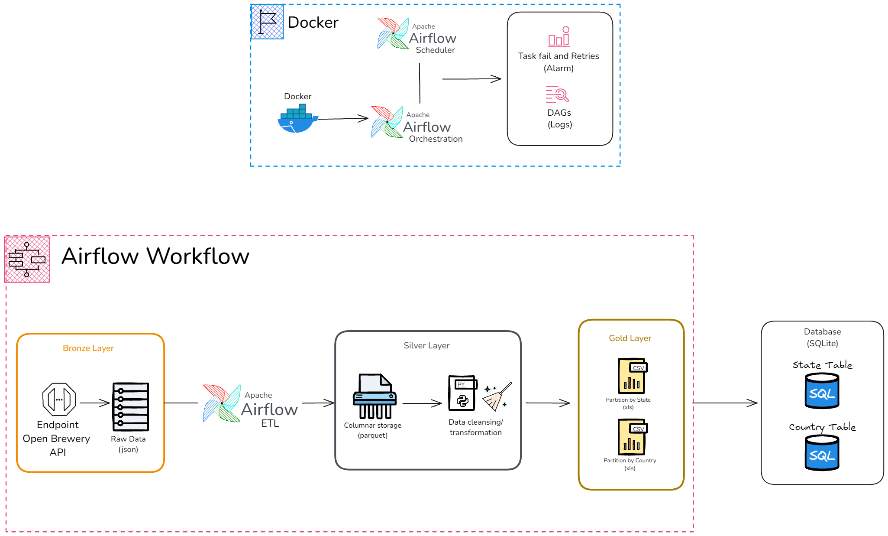

# br**E**w**T**ifu**L** Data Pipeline Project

## About

This project is a complete data pipeline for breweries data using a medallion architecture (bronze, silver, and gold layers). It extracts raw data from an API (Open Brewery API), transform, aggregate (based on assignment) and load to SQLite DB. The pipeline is containerized using **Docker** for consistent environment setup and deployment, and it utilizes technologies such as `pandas`, `sqlite3`, and `Apache Airflow` to manage data processing and scheduling.

  <p align="center">
  
</p>

## Solution Design

The project follows a structured approach based on the medallion architecture, ensuring that data flows seamlessly through different layers with transformations applied at each step:

1. **Bronze Layer**: Stores raw data fetched from the OpenBrewery API in *.json* format.
2. **Silver Layer**: Processes the raw data into a columnar format *(parquet)*, with partitioning by brewery location (state and country) for faster access and querying.
3. **Gold Layer**: Aggregates the data and do calculations, such as the number of breweries per type and location also load each aggregate to a SQLite DB table, ready for data analytics and reporting.

This architecture allows for scalability*, flexibility, and efficient data management across different stages of the pipeline.

**In a production scenario, needs to change to a robust Database like a PostgreSQL or MySQL.*

## Features

- **Data Extraction**: Fetches breweries data from the OpenBrewery API and stores it in the bronze layer.
- **Data Transformation**: Converts raw data into parquet format, performs data cleansing, and partitions data by brewery location.
- **Data Aggregation**: Creates summary tables to show brewery counts by type and location.
- **Automated Pipeline**: Manages the pipeline with Apache Airflow for periodic data refreshes.
- **Docker Integration**: Containerizes the entire setup using Docker for consistent environment configuration and easy deployment.
- **Test case**: The project includes unit tests to ensure the reliability and correctness of the data extraction process.

## Monitoring and Alerting

- **Data Quality Checks**: Implement checks based on Null Values, Row Count, tracking expected number of records and searching for high change based on last runs.
- **Task Monitoring**: Use Airflow’s task failure alerts to notify when a job fails based on status, task duration setting runtimes.
- **Auto Mechanisms**: Implement automatically mechanisms like a retry logic (based on alarms and logs).
- **Messaging Alerts**: Configure email alerts for pipeline failures or data quality issues to alert specific teams and link with Messaging Platforms e.g (Slack, MS Teams) for real-time alerts.
- **Logs**: Access detailed logs in the Airflow UI to identify and troubleshooting.

## Technologies Used and Requirements

- `Python`: 🐍
- `Docker`: Containerization for consistent environments and deployment.
- `Apache Airflow`: Workflow management and task scheduling.
- `Pandas`: Data manipulation and analysis.
- `SQLite3`: Lightweight database for storing aggregated data.

## Docker Setup

This project uses **Docker** to simplify the deployment and execution of the data pipeline (Also enabling us to use Airflow in a Windows setup):
- **Docker Image**: All dependencies and configurations are encapsulated within a Docker image.
- **Docker Compose**: The setup is orchestrated using Docker Compose to manage multiple services, including the Airflow web server and scheduler.
- This approach ensures that the environment is consistent across different setups, making it easier to deploy and scale.

### Commands to Get Started with Docker

1. **Build the Docker Image**:
   ```bash
   docker-compose build --no-cache
2. **Start the Docker Services**:
   ```bash
   docker-compose up -d
   
3. **Access the Airflow Web Interface**: Now you can access the Airflow to monitor the `breweries.py` DAG by http://localhost:8080 URL.
